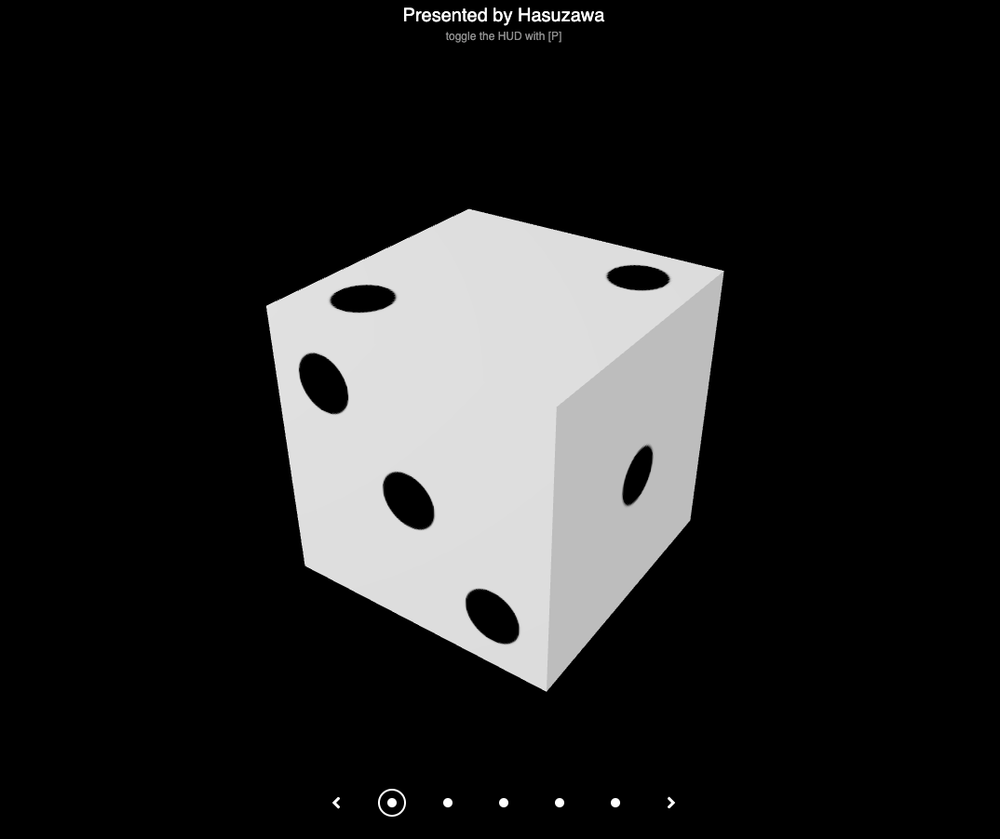

## Gallery for simple 3D objects

[to the Gallery](https://github.com/Hasuzawa/3D-gallery)

You can use arrow keys or Q,W to navigate between items.
You can toggle the HUD with P.

A very simple gallery for some 3D objects I created in Blender. Rendered with WebGL and Three.js.
This is a demo project.

I referenced some items in video game because I wanted to focus on the frontend and not modeling. This is non-commercial. That said, if the rightful owner do not wish to see them appear in this project, send me a message and I will remove them.

## Preview

